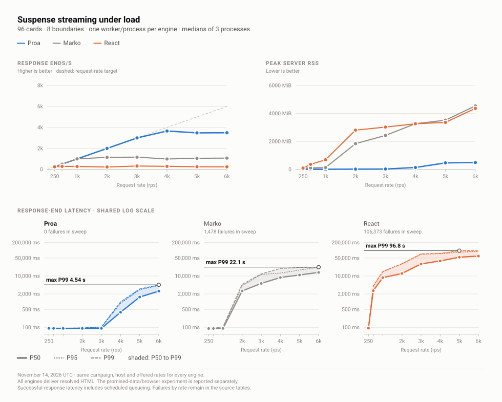

# HTTP capacity, cold start and streaming

The [Proa versus SvelteKit report](sveltekit.md) includes the production SvelteKit server below and a separate async comparison with browser completion. Its native promise-data stream has a different HTTP completion boundary from the resolved-HTML streams in this page.

One core of each framework's production server serves the same parity-gated pages over loopback HTTP. This page records [sustained capacity and latency at equal load](#canonical-pages-over-http-one-core-each), [cold start to first response](#cold-start-to-first-response), and [Suspense streaming](#suspense-streaming-over-http-one-core-each).

<!-- page-load:start -->
## Canonical pages over HTTP, one core each

**November 14, 2026 · Intel(R) Xeon(R) 6985P-C CPU @ 2.30GHz · 5 production servers · every response byte-identical to its parity-gated dump**

This is the capacity question behind the scoreboard: the same three parity-gated pages, served over real loopback HTTP/1.1 by each framework's ordinary production server, with every engine limited to one core of work. Proa runs one Tokio worker thread on Axum, React and Marko run one Bun process, and Go runs `GOMAXPROCS=1` on `net/http`. On the product grid, one Proa core sustained 16,593 complete responses per second against 1,383 for React, and spent 0.064 ms of CPU per response against React's 0.744 ms.

Each value is the median of 3 fresh server processes. **Capacity** rows use 64 closed-loop connections issuing requests back to back; throughput counts complete responses inside a fixed 5-second window after a 1-second pre-roll. **CPU per response** is the server process's exact CPU-time delta across all of its threads, including garbage-collector helpers, divided by successful responses. The load generator is 24 separate worker processes that hash every response; a phase is rejected if any worker's event loop exceeds 80% busy.

| Workload | Engine | Sustained responses/s | Proa ÷ engine | CPU per response | Cores used | Peak RSS |
| --- | --- | ---: | ---: | ---: | ---: | ---: |
| Component page | Proa | 93,176 | 1.00× | 0.011 ms | 1.00 | 8.7 MiB |
| Component page | React | 6,718 | 13.9× | 0.155 ms | 1.00 | 99.6 MiB |
| Component page | Marko | 33,112 | 2.81× | 0.032 ms | 1.00 | 88.7 MiB |
| Component page | Go html/template | 5,521 | 16.9× | 0.181 ms | 1.00 | 16.2 MiB |
| Component page | SvelteKit | 6,433 | 14.5× | 0.168 ms | 1.00 | 114.5 MiB |
| Product grid | Proa | 16,593 | 1.00× | 0.064 ms | 1.00 | 9.1 MiB |
| Product grid | React | 1,383 | 12.0× | 0.744 ms | 1.00 | 118.0 MiB |
| Product grid | Marko | 4,527 | 3.67× | 0.225 ms | 1.00 | 118.5 MiB |
| Product grid | Go html/template | 773 | 21.5× | 1.294 ms | 1.00 | 15.7 MiB |
| Product grid | SvelteKit | 1,169 | 14.2× | 0.897 ms | 1.00 | 314.5 MiB |
| 1,000-row table | Proa | 1,773 | 1.00× | 0.594 ms | 1.00 | 10.6 MiB |
| 1,000-row table | React | 131 | 13.5× | 7.740 ms | 1.00 | 171.7 MiB |
| 1,000-row table | Marko | 456 | 3.88× | 2.234 ms | 1.00 | 119.7 MiB |
| 1,000-row table | Go html/template | 63 | 28.2× | 15.923 ms | 1.00 | 16.6 MiB |
| 1,000-row table | SvelteKit | 185 | 9.58× | 5.564 ms | 1.00 | 696.7 MiB |

Translating CPU per response into fleet size: the cores needed to serve 10,000 responses per second of each page, from the measured CPU per response. Real deployments add headroom, but the ratios carry over.

| Workload | Proa | React | Marko | Go html/template | SvelteKit |
| --- | ---: | ---: | ---: | ---: | ---: |
| Component page | 0.1 | 1.5 | 0.3 | 1.8 | 1.7 |
| Product grid | 0.6 | 7.4 | 2.2 | 12.9 | 9.0 |
| 1,000-row table | 5.9 | 77.4 | 22.3 | 159.2 | 55.6 |

**Latency at equal load** uses fixed-rate open-loop arrivals below every engine's knee, so the percentiles compare the same request-rate target rather than each server's own saturation point. Latency is measured from scheduled arrival and includes generator lag.

| Workload | Engine | Request rate (rps) | Complete P50 | Complete P99 | CPU per response | Peak RSS |
| --- | --- | ---: | ---: | ---: | ---: | ---: |
| Component page | Proa | 2,000 | 0.12 ms | 0.52 ms | 0.021 ms | 7.4 MiB |
| Component page | React | 2,000 | 0.23 ms | 10.4 ms | 0.206 ms | 92.8 MiB |
| Component page | Marko | 2,000 | 0.13 ms | 1.56 ms | 0.073 ms | 63.9 MiB |
| Component page | Go html/template | 2,000 | 0.24 ms | 0.78 ms | 0.197 ms | 15.2 MiB |
| Component page | SvelteKit | 2,000 | 0.24 ms | 23.0 ms | 0.248 ms | 105.4 MiB |
| Product grid | Proa | 500 | 0.35 ms | 0.98 ms | 0.119 ms | 7.9 MiB |
| Product grid | React | 500 | 0.91 ms | 2.76 ms | 0.828 ms | 109.0 MiB |
| Product grid | Marko | 500 | 0.42 ms | 1.06 ms | 0.286 ms | 75.6 MiB |
| Product grid | Go html/template | 500 | 1.30 ms | 2.04 ms | 1.290 ms | 15.1 MiB |
| Product grid | SvelteKit | 500 | 0.90 ms | 11.1 ms | 0.891 ms | 122.1 MiB |
| 1,000-row table | Proa | 50 | 1.80 ms | 2.37 ms | 0.833 ms | 9.2 MiB |
| 1,000-row table | React | 50 | 6.90 ms | 14.5 ms | 7.322 ms | 142.8 MiB |
| 1,000-row table | Marko | 50 | 2.77 ms | 4.15 ms | 2.466 ms | 87.2 MiB |
| 1,000-row table | Go html/template | 50 | 16.3 ms | 17.4 ms | 16.177 ms | 15.3 MiB |
| 1,000-row table | SvelteKit | 50 | 5.08 ms | 16.5 ms | 5.512 ms | 160.6 MiB |

Every measured response was compared byte for byte against the dump the same engine produced through its canonical adapter, which is the dump that passed the scoreboard's browser-DOM parity gate.

| Engine version | Component page bytes | Product grid bytes | 1,000-row table bytes | HTTP responses |
| --- | ---: | ---: | ---: | --- |
| Proa 0.3.0 @ ceffd9f3 | 25,108 | 284,908 | 988,509 | byte-identical |
| React 19.2.4 | 25,202 | 285,868 | 990,695 | byte-identical |
| Marko 6.0.150 | 24,038 | 282,604 | 983,187 | byte-identical |
| Go html/template go1.25.5 | 25,108 | 285,676 | 990,509 | byte-identical |
| SvelteKit 3.1.0 / Svelte 5.57.2 / adapter-node 6.0.0 | 25,959 | 286,704 | 1,003,437 | byte-identical |

- Capture: [benchmarks/http/results/latest.json](../../benchmarks/http/results/latest.json); reproduce with `bun run bench:page-load`.
- Proa serves through `RouteResponse::ssr` on an Axum router; React through `renderToString` into `response.end`; Marko through its compiled template's `render().pipe(response)`; Go through `html/template` `Execute` into the `ResponseWriter`.
- JavaScript engines run with `NODE_ENV=production`: the driver sets it, each server's health endpoint reports it back, and React reports that it loaded the production `react-dom/server` build. The runner refuses to measure otherwise.
- Compression is disabled for every engine so CPU is not dominated by a shared compression setting. Routing, databases, and network latency are outside this measurement; HTTP parsing, response serialization, allocation, and each server's write path are inside it.
- This is a one-host, one-core capacity measurement. Multi-core deployments scale each engine by its own process or thread model; the per-response CPU cost is the portable number.
<!-- page-load:end -->

*Sustained responses per second, CPU per response, and peak RSS from the capacity table above. Bars are medians of three fresh server processes. [Full size](../figures/08-canonical-pages-http.svg) · [how the figures are built](../../tooling/charts/)*

The same servers pay a start-up cost on every fresh process, measured next in [Cold start to first response](#cold-start-to-first-response).

<!-- cold-start:start -->
## Cold start to first response

**November 14, 2026 · Intel(R) Xeon(R) 6985P-C CPU @ 2.30GHz · 15 fresh processes per engine**

Every autoscaling event, cold serverless instance, per-tenant process, and developer restart pays this cost. Each row spawns the same production server used in the HTTP capacity section, polls its port every millisecond, and stops the clock when the first complete product-grid response ends; that response must be byte-identical to the engine's canonical dump. Proa's first response arrived in 5.54 ms at the median against 48.0 ms for React, whose figure includes Bun 1.4.2 start-up and loading React and the page module. Engines rotate every start, 2 untimed starts warm the disk cache, and the RSS column is sampled immediately after the first response.

| Engine | First response P50 | P95 | Max | First byte P50 | RSS after first response |
| --- | ---: | ---: | ---: | ---: | ---: |
| Proa 0.3.0 @ ceffd9f3 | 5.54 ms | 10.9 ms | 12.3 ms | 5.39 ms | 6.2 MiB |
| React | 48.0 ms | 56.2 ms | 60.9 ms | 47.8 ms | 57.5 MiB |
| Marko | 33.7 ms | 37.3 ms | 37.7 ms | 33.5 ms | 40.0 MiB |
| Go html/template | 10.2 ms | 11.6 ms | 12.0 ms | 8.98 ms | 9.9 MiB |
| SvelteKit | 58.3 ms | 64.5 ms | 64.7 ms | 58.1 ms | 51.1 MiB |

- Capture: [benchmarks/cold-start/results/latest.json](../../benchmarks/cold-start/results/latest.json); reproduce with `bun run bench:cold-start`.
- Servers, ports, and per-core limits are the same as the [HTTP capacity section](#canonical-pages-over-http-one-core-each). Wall time includes process creation, runtime start-up, module or binary loading, fixture construction, and the first render.
- Host one-minute load average when the capture started: 5.30 on 16 logical CPUs. Cold start is a few milliseconds of wall time, so it is the measurement most sensitive to other work on the machine; rerun it on an idle host before quoting absolute values.
<!-- cold-start:end -->

*Fifteen fresh processes per engine. The bar is the median, the tick P95, and the hollow endpoint the slowest start. [Full size](../figures/09-cold-start.svg) · [how the figures are built](../../tooling/charts/)*

The product grid also streams, which is the subject of [Suspense streaming over HTTP](#suspense-streaming-over-http-one-core-each).

<!-- suspense-load:start -->
## Suspense streaming over HTTP, one core each

**November 14, 2026 · Intel(R) Xeon(R) 6985P-C CPU @ 2.30GHz · 8 async boundaries × 12 product cards · one worker thread or process per engine**

This is the product grid from the capacity section, streamed. Equivalent production-mode Proa, Marko, and React applications run over real loopback HTTP/1.1. Every request streams a shell, starts 8 independent data operations across the 5, 8, 12, 18, 27, 40, 60, 90 ms delay tiers, may stream loading placeholders while those operations are pending, and completes only after every panel has resolved to its 12 product cards on the wire, 96 cards in all. Delayed values stay typed and in memory; there is no JSON serialization, deserialization, or external I/O in the measured request path. Rendering, boundary scheduling, replacement framing, and one flush per boundary are all inside the measurement.

Every engine is limited to one unit of concurrency: Proa runs 1 Tokio worker thread, and Marko and React each run one Bun process. Proa serves this page through `RouteResponse::ssr_stream_send`, the compiler-proved `Send` streaming path introduced by [Proa PR #82](https://github.com/Proa-Labs/proa/pull/82): Axum polls the response stream directly, with no per-response bridge thread. The cores column shows what each process actually used, and CPU/request charges every thread of every engine the same way.

Each row is the median of 3 fresh-process phases under fixed-rate open-loop arrivals from 32 separate load-generator processes, so saturation remains visible as in-flight work and scheduled-arrival latency instead of being suppressed by a client waiting for each prior response. A 1-second pre-roll fills the async pipeline, then successful full responses completed inside a fixed 5-second observation window determine completion throughput. Complete-response percentiles and shell P50 cover requests arriving during that observation window and include load-generator scheduling lag and server queueing. CPU/request is the server process's exact CPU-time delta divided by successful responses across the full phase. Errors are summed across the 3 repeats. Publication aborts if scheduler-lag P95 exceeds 25 ms or any generator worker exceeds 80% busy in any phase, and each phase waits for the previous phase's client sockets to leave TIME_WAIT before it starts.

| Engine | Request rate (rps) | Window completions/s | Shell P50 | Complete P50 | Complete P95 | Complete P99 | CPU/request | Cores | Peak RSS | Max in-flight | Generator lag P95 | Errors |
| --- | ---: | ---: | ---: | ---: | ---: | ---: | ---: | ---: | ---: | ---: | ---: | ---: |
| Proa | 250 | 250 | 0.27 ms | 91.7 ms | 91.8 ms | 92.3 ms | 0.242 ms | 0.06 | 8.2 MiB | 24 | 0.01 ms | 0 |
| Proa | 500 | 500 | 0.26 ms | 91.4 ms | 91.5 ms | 92.3 ms | 0.239 ms | 0.12 | 9.8 MiB | 47 | 0.01 ms | 0 |
| Proa | 1,000 | 1000 | 0.18 ms | 91.3 ms | 91.5 ms | 92.3 ms | 0.238 ms | 0.23 | 12.1 MiB | 98 | 0.01 ms | 0 |
| Proa | 2,000 | 2000 | 0.23 ms | 91.3 ms | 92.8 ms | 94.8 ms | 0.260 ms | 0.51 | 18.3 MiB | 211 | 1.27 ms | 0 |
| Proa | 3,000 | 3000 | 0.75 ms | 91.9 ms | 101.6 ms | 103.8 ms | 0.276 ms | 0.82 | 25.3 MiB | 327 | 3.37 ms | 0 |
| Proa | 4,000 | 3507 | 23.2 ms | 564.4 ms | 1264.1 ms | 1385.1 ms | 0.279 ms | 0.99 | 179.6 MiB | 3,243 | 7.39 ms | 0 |
| Proa | 5,000 | 3412 | 658.0 ms | 1680.0 ms | 3011.6 ms | 3291.3 ms | 0.282 ms | 1.00 | 467.1 MiB | 9,991 | 7.22 ms | 0 |
| Proa | 6,000 | 3443 | 1351.5 ms | 2752.7 ms | 4409.0 ms | 4953.9 ms | 0.285 ms | 1.00 | 488.3 MiB | 15,902 | 8.02 ms | 0 |
| Marko | 250 | 250 | 0.39 ms | 90.4 ms | 91.3 ms | 92.4 ms | 0.919 ms | 0.23 | 95.3 MiB | 25 | 0.01 ms | 0 |
| Marko | 500 | 500 | 0.41 ms | 90.3 ms | 91.9 ms | 95.2 ms | 0.801 ms | 0.39 | 105.6 MiB | 53 | 0.00 ms | 0 |
| Marko | 1,000 | 1000 | 0.43 ms | 90.9 ms | 96.5 ms | 105.9 ms | 0.721 ms | 0.71 | 130.8 MiB | 122 | 0.01 ms | 0 |
| Marko | 2,000 | 1131 | 2756.0 ms | 3003.2 ms | 4893.8 ms | 7065.8 ms | 0.850 ms | 0.95 | 1849.0 MiB | 5,423 | 0.08 ms | 0 |
| Marko | 3,000 | 1087 | 5254.0 ms | 5366.6 ms | 12373.2 ms | 19775.4 ms | 0.862 ms | 0.70 | 3287.7 MiB | 11,832 | 0.12 ms | 0 |
| Marko | 4,000 | 942 | 8268.0 ms | 8372.0 ms | 13436.0 ms | 19800.6 ms | 0.835 ms | 0.93 | 3229.2 MiB | 18,567 | 0.41 ms | 181 |
| Marko | 5,000 | 1043 | 11143.4 ms | 11149.7 ms | 18432.8 ms | 36093.7 ms | 0.832 ms | 0.68 | 4295.4 MiB | 24,253 | 0.38 ms | 715 |
| Marko | 6,000 | 1056 | 13686.7 ms | 13686.8 ms | 22458.9 ms | 23120.7 ms | 0.839 ms | 0.80 | 3763.2 MiB | 30,204 | 0.53 ms | 130 |
| React | 250 | 250 | 0.70 ms | 93.6 ms | 97.1 ms | 99.0 ms | 3.291 ms | 0.81 | 92.6 MiB | 31 | 0.01 ms | 0 |
| React | 500 | 290 | 442.0 ms | 2619.6 ms | 4233.3 ms | 4292.4 ms | 3.392 ms | 1.00 | 385.2 MiB | 1,281 | 0.01 ms | 0 |
| React | 1,000 | 278 | 2695.8 ms | 9014.1 ms | 15249.5 ms | 19734.1 ms | 3.454 ms | 0.87 | 734.0 MiB | 4,371 | 0.01 ms | 0 |
| React | 2,000 | 253 | 7608.3 ms | 19714.0 ms | 40052.4 ms | 68669.8 ms | 3.557 ms | 0.57 | 1274.4 MiB | 10,574 | 0.01 ms | 6,926 |
| React | 3,000 | 279 | 25634.8 ms | 37865.7 ms | 69663.6 ms | 71588.1 ms | 4.448 ms | 0.81 | 3428.7 MiB | 16,603 | 0.01 ms | 14,398 |
| React | 4,000 | 280 | 29661.5 ms | 43729.1 ms | 71173.4 ms | 72424.5 ms | 4.726 ms | 0.55 | 2957.7 MiB | 22,601 | 0.01 ms | 22,519 |
| React | 5,000 | 230 | 42256.0 ms | 55927.5 ms | 85358.4 ms | 87075.6 ms | 5.091 ms | 0.59 | 3496.7 MiB | 28,852 | 0.01 ms | 33,971 |
| React | 6,000 | 242 | 55039.8 ms | 60055.8 ms | 93001.9 ms | 95239.4 ms | 4.697 ms | 0.65 | 4704.3 MiB | 34,791 | 0.01 ms | 36,202 |

**Every comparative row uses one logical CPU.** Proa runs one Tokio worker thread, and Marko and React each run one Bun process. Server CPU affinity is 0; the load generator runs separately. Above saturation, completed responses can plateau or decline while queueing and failures increase. This capture does not measure multicore capacity.

**Reference point, outside the comparison.** Proa alone was rerun at the top rate with 4 worker threads. CPU affinity remains 0; this changes thread count within the same CPU budget and does not measure multi-core scaling. Marko and React were not rerun with more processes, so this row is not comparable to theirs. With 4 threads Proa completed 3,537 responses per second at a request-rate target of 6,000 rps and a P99 of 5316.3 ms, using 1.00 cores.

| Proa worker threads | Request rate (rps) | Window completions/s | Complete P50 | Complete P99 | CPU/request | Cores | Peak RSS | Errors |
| --- | ---: | ---: | ---: | ---: | ---: | ---: | ---: | ---: |
| 4 | 6,000 | 3537 | 2366.7 ms | 5316.3 ms | 0.285 ms | 1.00 | 510.4 MiB | 0 |

The unloaded preflight checks all loading placeholders and resolved panels. Every measured response must contain the shell, all resolved panels, and every product card. Loading placeholders are optional during load: a boundary can resolve before its placeholder is flushed. Any placeholders present must have valid, unique boundary keys. The cards are the same markup the scoreboard's product-grid parity gate accepted from each engine. Wire bytes legitimately differ because each framework carries its own boundary-replacement protocol.

| Engine version | Fallback panels | Resolved panels | Product cards | Stream bytes |
| --- | ---: | ---: | ---: | ---: |
| Proa 0.3.0 @ ceffd9f3 | 8 | 8 | 96 | 387,511 |
| Marko 6.0.150 | 8 | 8 | 96 | 289,888 |
| React 19.2.4 | 8 | 8 | 96 | 292,213 |

- Capture: [benchmarks/streaming/results/latest.json](../../benchmarks/streaming/results/latest.json); reproduce with `bun run bench:suspense-load`.
- The report verifier checks the measured-source SHA-256 against this checkout or the retained source snapshot before generating these tables.
- Proa source: Cargo.lock revision ceffd9f3; Rust release build with native Proa Suspense and the direct `ssr_stream_send` Axum route. The same binary also serves the bounded local-executor path (`ssr_stream`) at `/local` for engineering comparison; it is not part of the published rows.
- Marko source: optimized ahead-of-time Marko template using native &lt;await&gt; plus &lt;@placeholder&gt;; its compiler is not resident in the measured server.
- React source: production Bun React server build using renderToReadableStream, Suspense, and use. The shell pipes immediately; allReady is not awaited.
- JavaScript engines run with `NODE_ENV=production`: the driver sets it, each server's health endpoint reports it back, and React reports that it loaded the production `react-dom/server` build. The runner refuses to measure otherwise.
- Stream bytes differ by protocol, not content: Proa base64-encodes each resolved boundary inside an inert template, so its stream is roughly a third larger on the wire than React's for the same 96 cards. Compression is off in every engine here; enabling it would remove most of that gap, at a CPU cost this benchmark deliberately leaves out.
- This is a single-host capacity curve, not a universal ranking. Loopback transfer, each framework’s HTTP adapter, boundary protocol, allocation, scheduling, and render work are all intentionally inside the application boundary.
<!-- suspense-load:end -->

*Every line is one core: response ends at each request-rate target, the P50, P95, and P99 of the full response, and peak memory. Once a line drops below the target rate the engine has saturated and its latency is queueing. Each latency panel marks its highest P99 with a leader from the axis. Marko and React come from the table above; Proa and SvelteKit come from the newer [SvelteKit comparison capture](sveltekit.md#http-streaming-capacity-and-latency), so the chart's Proa line will not match the Proa rows above exactly. SvelteKit's response end delivers data, not rendered HTML. [Full size](../figures/07-suspense-load.svg) · [how the figures are built](../../tooling/charts/)*

## Next steps

- [Front page](../../README.md)
  - The four figures and the reasons to trust them.
- [Canonical scoreboard evidence](scoreboard.md)
  - The render-only timings these servers wrap, for seventeen renderers.
- [Shared HTTP load driver](../../tooling/load/)
  - Why a benchmark never reports a client knee as a server knee.
- [Page-load suite](../../benchmarks/http/), [cold-start suite](../../benchmarks/cold-start/), and [Suspense suite](../../benchmarks/streaming/)
  - Each suite's contract, engines, and reproduction commands.
